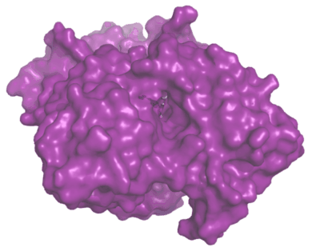

Figuring out how to generate `.maps.fld` files for use with AutoDock can be a bit tricky. If you just want to try out AutoDock without messing with autogrid and the other support scripts from AutoDockTools, this is your starting point. This repo is simply the prepared `.pdbqt` and `.maps.fld` for quickly testing out docking programs. The protein-ligand pair is acetycholinesterase and its inhibitor, Huperzine. The PDB structure id is [1gpk](https://www.rcsb.org/structure/1GPK)

 Acetycholinesterase and Huperzine after re-docking with Smina. The blue small molecule is the re-docked version, the pink is the position from the solved structure.

For more docking fun, check out my repo for docking scoring function optimization with evolutionary reinforcement learning at [https://github.com/rivesunder/DockRL](https://github.com/rivesunder/DockRL).
